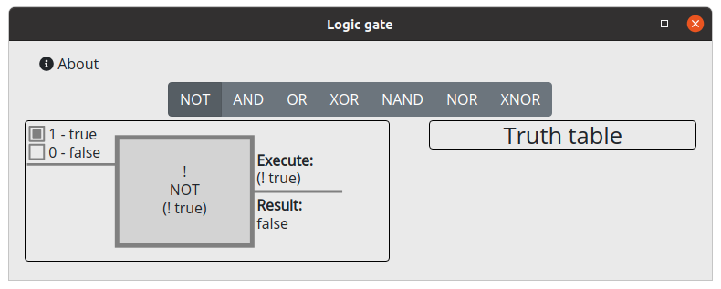

# Logic gate

Graphic explanation of a logic gate.

## Download

> Note: Currently the program is not signed.
> Therefore, most antivirus programs will recognize the software as harmful.
> If that happens, you will need to whitelist the software.

| Windows | Linux | Mac |
|:---:|:---:|:---:|
| [logic-gate_win_64.exe](https://github.com/Cyb10101/electron_logic-gate/releases/latest/download/logic-gate_win_x64.exe) | [logic-gate_linux_amd64.deb](https://github.com/Cyb10101/electron_logic-gate/releases/latest/download/logic-gate_linux_amd64.deb) | Issue: Compiling without Mac |
| | [logic-gate_linux_x86_64.AppImage](https://github.com/Cyb10101/electron_logic-gate/releases/latest/download/logic-gate_linux_x86_64.AppImage) | |

## Documentation

* [Development](docs/development.md)
